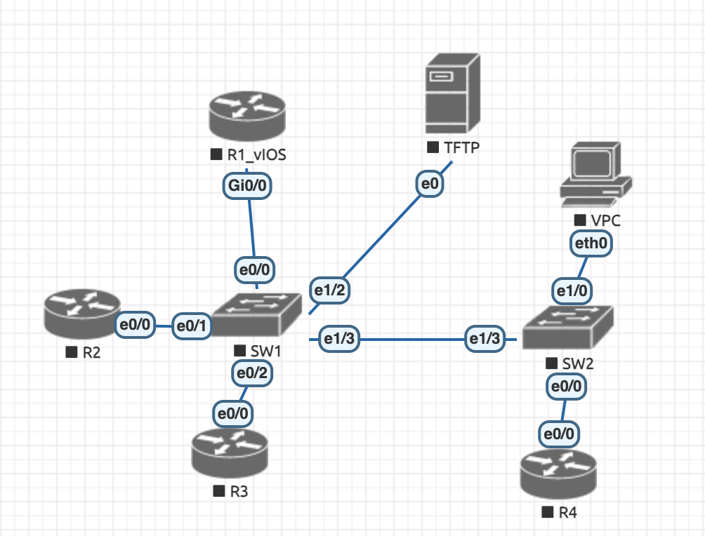

# Laboratório 1

Objetivos:
Configurar um ambiente com 4 Roteadores e 2 Switchs.

R1 deverá ter um serviço DHCP na vlan 1 com o bloco 10.20.1.0/24
Deverá ser configurado também 4 vlans sendo uma para gerencia de todos os equipamentos:

vlan 10 bloco 10.20.10.0/30\
vlan 20 bloco 10.20.20.0/30\
vlan 30 bloco 10.20.30.0/30\
vlan 100 (mgmt) bloco 10.20.100.0/24

A configuração de R2, R3 e R4 se dará pelo processo de autoinstall da cisco.

R2 irá receber a vlan 10 e vlan 100\
R3 irá receber a vlan 20 e vlan 100\
R4 irá receber a vlan 30 e vlan 100

## Autoinstall Cisco

O processo de autoinstall da cisco é bem simples, basicamente na inicialização de um switch ou roteador cisco, ele tenta buscar informações a respeito de si em um serviço TFTP na rede. A interface entra em modo DHCP, recebe um endereço IP e caso no pacote recebido ele encontre um option 150 ou alguma informação a respeito de onde buscar um arquivo de configuração ele irá baixar inicialmente (caso não recebe um bootfilename) o arquivo padrão chamado de `network-confg` e após não encontrar esse nome, ele irá procurar outros.

No nosso caso, ele irá receber no pacote DHCP um option 150 que indicará o endereço IP do servidor TFTP, em seguida ele irá buscar o arquivo network-confg e se configurar, já que o mesmo existe.
Aqui temos um detalhe, se você procurar entender o conteúdo do arquivo você verá que não tem nada alem da definição de alguns nomes. Isso se dá pois não queremos que todos os roteadores tenham a mesma configuração e sim cada um puxe a sua configuração, e para isso precisariamos de uma forma de dizer quem é quem. Isso pode ser dito através do uuid do dispositivo (o que não é algo tão simples de se obter sem ligar o aparelho), ou utilizar um hostname para o dispositivo, atrelado ao seu IP.
Com isso o arquivo `network-confg` seta 3 IPs e hostnames para cada um, sendo assim, o roteador irá pegar essa configuração inicial, irá ver qual é o seu IP e Hostname e irá buscar em seguida o arquivo com o nome `rX-confg` onde X é o numero do roteador.
Assim conseguimos que cada um puxe um arquivo diferente. Isso também poderia ser feito através de DNS, porém para simplificar optamos por fazer de modo manual.

## Conexões

R1 - Portas\
Gi0/0 - Gi0/0 SW1\
[Configuração do R1](config-R1.txt)

R2 - Portas\
Gi0/0 - Gi0/1 SW1\
[Configuração do R2](r2-confg)

R3 - Portas\
Gi0/0 - Gi0/2 SW1\
[Configuração do R3](r3-confg)

R4 - Portas\
Gi0/0 - Gi0/0 SW2\
[Configuração do R4](r4-confg)

SW1 - Portas\
Gi0/0 - Gi0/0 R1\
Gi0/1 - Gi0/0 R2\
Gi0/2 - Gi0/0 R3\
Gi1/2 - eth0 TFTP\
Gi1/3 - Gi1/3 SW2\
[Configuração do SW1](config-SW1.txt)

SW2 - Portas\
Gi0/0 - Gi0/0 R4\
Gi1/0 - eth0 VPC\
Gi1/3 - Gi1/3 SW1\
[Configuração do SW2](config-SW2.txt)

TFTP - Portas\
eth0 - Gi1/2 SW1\
[Configuração Servidor](Server1.md)

VPC - Portas\
eth0 - Gi1/0 SW2

## Imagens Utilizadas
- Cisco IOL l2
- Cisco IOL l3
- Cisco vIOS
- Linux Ubuntu 22.04

## Material Base (ZTP - Zero Touch Provisioning)

[Fundamentals Autoinstall - Cisco](https://www.cisco.com/c/en/us/td/docs/ios-xml/ios/fundamentals/configuration/15mt/fundamentals-15-mt-book/cf-autoinstall.html)\
[Freeztp](https://packetpushers.net/blog/freeztp/)\
[Tutorial ZTP](https://networklore.com/ztp-tutorial/introduction/)

## Repositórios de Código ZTP
[IOSXE Zero Touch Provisioning](https://github.com/jeremycohoe/IOSXE-Zero-Touch-Provisioning)\
[IOSXE ZTP](https://github.com/cisco-ie/IOSXE_ZTP)\
[ZTP](https://github.com/tdorssers/ztp)\
[ZTP Generator](https://github.com/consentfactory/ztpgenerator)\
[Freeztp](https://github.com/PackeTsar/freeztp/tree/latest)