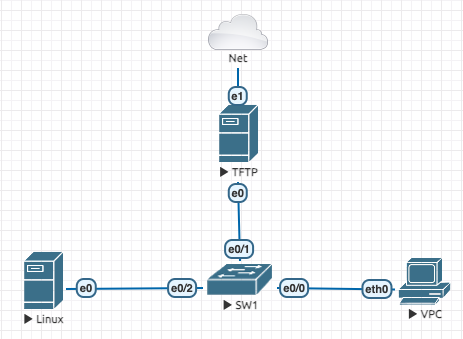
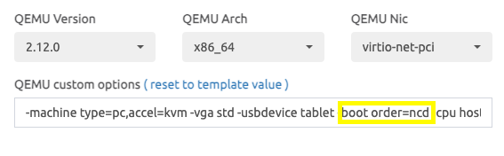

# Laboratorio 2

Objetivos:\
Configurar um servidor ubuntu 22.04 com:
- DHCP
- TFTP
- NFS
- iPXE
Assim será possível utilizar o servidor como ponto de provisionamento de sistemas operacionais pela rede. Provisiondo de forma mais simples e rápido servidores na rede.

Nesse laboratório não haverá vlans, os servidores apenas foram conectados ao switch e o mesmo ligado, sem configuração alguma.

Bloco de endereçamento utilizado: 10.20.1.0/24\
Servidor TFTP: 10.20.1.1 255.255.255.0\
Servidor linux e VPC ambos em DHCP.



## Funcionamento do Lab

## Conexões

SW1 - Portas\
Eth 1 - Eth 0 TFTP\
Eth 2 - Eth 0 Linux\
Eth 0 - Eth 0 VPC

Servidor TFTP - Portas\
Ens 3 - Eth 1 SW1\
Ens 4 - Eth Cloud (Internet)\
[Configuração Servidor](TFTP.md)

## Imagens Utilizadas
- Cisco IOL l2
- Linux Ubuntu Server 22.04

## Configuração dos nodes

Para que o node "Linux" possa fazer o boot pela rede, é necessário mudar um parâmetro na sua configuração. Basicamente ao criar o node, você precisa adicionar no campo QEMU Custom Options o parâmetro "n" em boot order. Isso fará com que seja realizado uma tentativa de boot pela rede, que é justamente o que precisamos.



#### QEMU custom options

- c : Boot the first virtual hard drive.
- d : Boot the first virtual CD-ROM drive.
- n : Boot from virtual network.

``` -machine type=pc,accel=kvm -vga std -usbdevice tablet -boot order=ncd -cpu host ```

## Links Base

- https://ubuntu.com/server/docs/how-to-install-and-configure-isc-dhcp-server
- https://wiki.gentoo.org/wiki/QEMU/Options#Boot_order
- https://ipxe.org/
- https://netboot.xyz/
- https://www.virten.net/2021/11/automated-esxi-installation-inject-kickstart-file-to-esxi-iso/
- https://docs.vmware.com/en/VMware-vSphere/7.0/com.vmware.esxi.install.doc/GUID-CAB84194-3D8E-45F0-ABF9-0277710C8F98.html